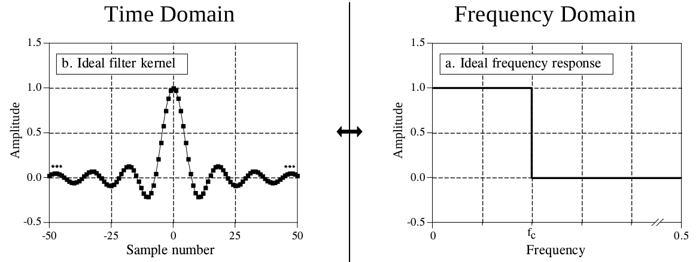
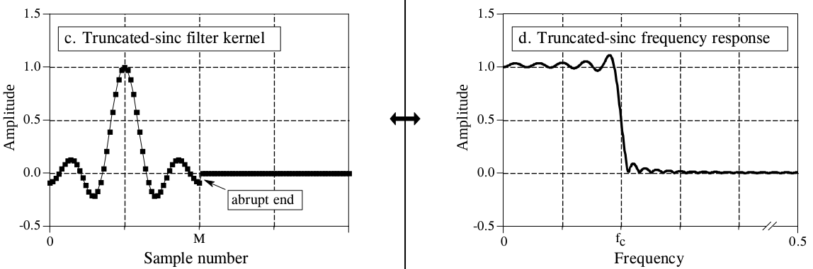
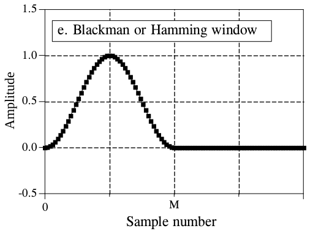
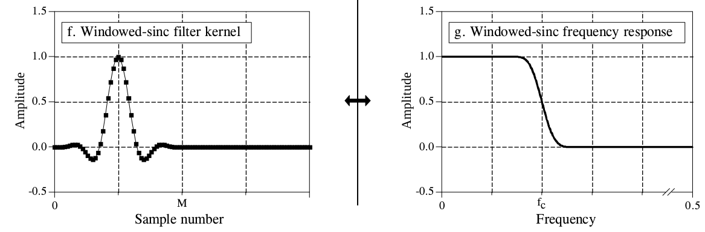
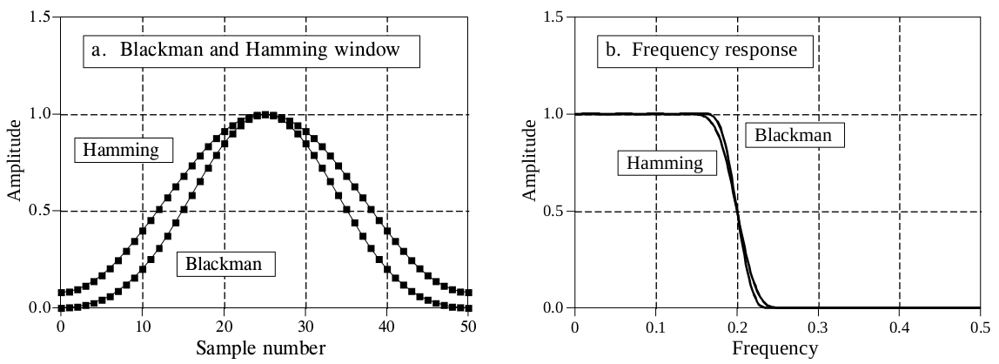
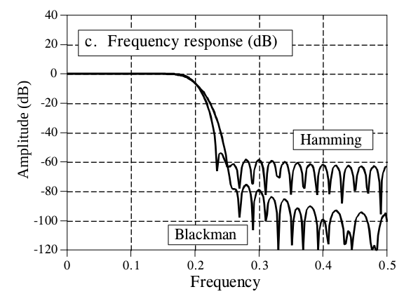
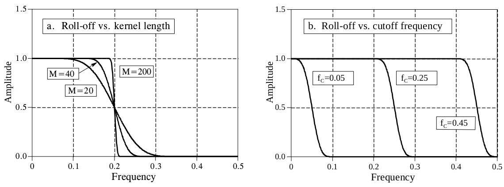

# Real_Time_Windowed-Sinc_Filter
Filtrado en dominio de la frecuencia mediante un filtro tipo Widowed-Sinc usando transformada de fourier inversa y funcion sinc de M/2 shift con una ventana de Blackman.

### Ventana Usada
<pre>

</pre>
Planteamiento ideal del filtro
<pre></pre>

<pre></pre>
Problema del truncamineto por analisis por numero de muestras

<pre></pre>
Idealizacion de ventana de Blackman or Hamming

<pre></pre>
Solucion mediate convolucion de ventana y filtro para el problema de truncado

<pre></pre>
Analisis de respuesta de filtro de acuerdo a ventana a usarse

<pre></pre>
Respuesta en frecuencia de las ventanas

<pre></pre>
Analisis del Roll Off para diseno del filtro

<pre></pre>
Para ello es recomandable usar la siguiente aproximacion para el diseno
<pre>

</pre>
